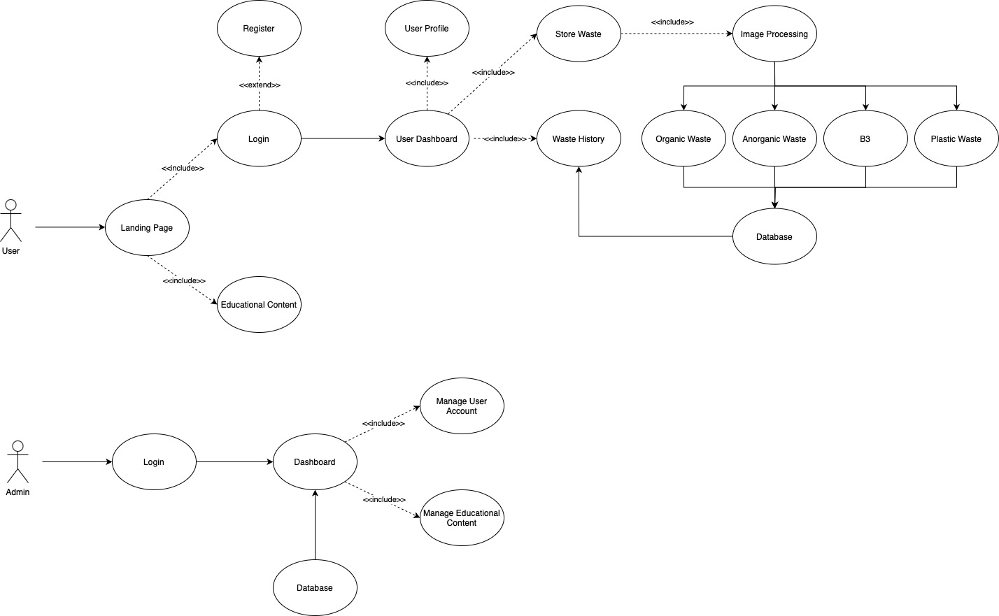

# Trashify

## Anggota dan NIM  
1. Adji Dharmawan Indrianto - 22/499366/TK/54743  
2. Steven Namora Roha Saragi Napitu - 22/505930/TK/55405  
3. Tsaniya Khamal Khasanah - 22/503817/TK/55074  

## Project  
Senior Project TI  

## Instansi  
Departemen Teknologi Elektro dan Teknologi Informasi,  
Fakultas Teknik, Universitas Gadjah Mada  

---

## Modul 1  

### Nama Produk:  
Trashify  

### Jenis Produk:  
Web Application  

### Latar Belakang & Permasalahan:  
Pengelolaan sampah menjadi tantangan besar di Indonesia. Hal ini disebabkan oleh:  
- Kurangnya sistem pemantauan sampah yang efektif.  
- Minimnya proses pemilahan dan daur ulang yang optimal.  
- Overload pada tempat pembuangan sampah karena tidak adanya sistem prediksi kapasitas real-time.  

Ketidakefisienan ini berdampak pada lingkungan dan menghambat upaya menciptakan sistem pengelolaan sampah yang berkelanjutan. Untuk mengatasi masalah ini, dikembangkan **Trashify**, aplikasi berbasis web yang membantu pengguna mencatat, melacak, dan mengoptimalkan pengelolaan sampah mereka.

Fitur utama Trashify:  
- **Pencatatan digital sampah**  
- **Pemilahan sampah dengan Image Processing**  
- **Rekomendasi daur ulang berbasis data**  
- **Integrasi dengan penyimpanan cloud dan API terkait**

### Rumusan Permasalahan:  
1. **Minimnya Proses Pemilahan Sampah yang Optimal**  
   - Masyarakat belum memahami cara memilah sampah dengan benar (organik, anorganik, berbahaya).  
   - Proses daur ulang menjadi tidak efisien, meningkatkan beban TPA.

2. **Overload di Tempat Pembuangan Sampah**  
   - Tidak ada sistem prediksi dan pemantauan kapasitas pembuangan secara real-time.

3. **Kurangnya Edukasi dan Kesadaran Masyarakat**  
   - Minimnya pemahaman tentang pentingnya pemilahan sampah, daur ulang, dan pengelolaan sampah berkelanjutan.

### Ide Solusi:  
**Trashify** adalah aplikasi berbasis web yang menyediakan solusi terintegrasi untuk pengelolaan sampah di Indonesia. Fitur utama meliputi:  
- **Pemilahan sampah otomatis** dengan teknologi image processing  
- **Pemantauan kapasitas pembuangan real-time**  
- **Integrasi dengan Google Maps API** untuk menemukan lokasi pembuangan terdekat  
- **Rekomendasi berbasis AI** untuk pengurangan dan daur ulang sampah  
- **Penyimpanan cloud dan API terintegrasi** untuk efektivitas sistem pengelolaan sampah  

---

## Analisis Kompetitor

### Kompetitor 1: Recycle Coach  
**Jenis Kompetitor:** Direct Competitor  
**Jenis Produk:** Mobile Application & Web Application  

**Target Customer:**  
Warga perkotaan, keluarga, dan pemerintah lokal yang membutuhkan panduan serta jadwal pengumpulan sampah yang disesuaikan dengan wilayahnya.

**Kelebihan:**  
- Menyediakan panduan dan jadwal pengumpulan sampah sesuai peraturan wilayah pengguna  
- Memberikan notifikasi jadwal pengambilan sampah dan daur ulang  
- Menawarkan konten edukasi tentang pemilahan dan daur ulang sampah  

**Kekurangan:**  
- Integrasi fitur hanya tersedia di wilayah tertentu  
- Beberapa pengguna mengalami kesulitan dengan tampilan dan navigasi aplikasi  

**Key Competitive Advantage & Unique Value:**  
Menawarkan panduan daur ulang yang sangat terlokalisasi dan personal, meningkatkan partisipasi masyarakat dalam program daur ulang lokal.

---

### Kompetitor 2: iRecycle  
**Jenis Kompetitor:** Indirect Competitor  
**Jenis Produk:** Web Application  

**Target Customer:**  
Individu, konsumen, dan pengusaha kecil yang mencari informasi detail tentang fasilitas daur ulang dan panduan penanganan material tertentu.

**Kelebihan:**  
- Menyediakan direktori besar lokasi fasilitas daur ulang di berbagai wilayah  
- Memberikan panduan detail mengenai jenis material apa saja yang bisa didaur ulang dan cara penanganannya  
- Desain aplikasi yang user friendly, memudahkan pengguna mencari informasi dan lokasi daur ulang  

**Kekurangan:**  
- Fitur personalisasi dan rekomendasi cerdas berbasis AI belum terintegrasi secara mendalam  
- Informasi lokasi dan panduan daur ulang terkadang tidak selalu terupdate  
- Fokus utama pada direktori dan panduan, belum menyediakan fitur interaktif seperti pelacakan riwayat sampah  

**Key Competitive Advantage & Unique Value:**  
Menjadi sumber informasi terlengkap dan terpercaya mengenai fasilitas daur ulang di berbagai wilayah, dengan penjelasan mendalam tentang cara mendaur ulang berbagai jenis material.

---

### Kompetitor 3: Recycle Nation  
**Jenis Kompetitor:** Direct Competitor  
**Jenis Produk:** Mobile Application & Web Application  

**Target Customer:**  
Individu yang peduli lingkungan, komunitas, dan organisasi yang terlibat dalam program keberlanjutan dan daur ulang.

**Kelebihan:**  
- Bekerja sama dengan berbagai penyedia layanan daur ulang sehingga informasi lokasi lebih akurat dan relevan  
- Menyediakan artikel, tips, dan panduan seputar daur ulang yang bermanfaat untuk meningkatkan kesadaran lingkungan  
- Menawarkan antarmuka yang sederhana dan mudah dinavigasi untuk menemukan informasi tentang titik daur ulang  

**Kekurangan:**  
- Tidak menawarkan rekomendasi cerdas berbasis analisis data pengguna (misal prediksi jadwal pembuangan)  
- Di beberapa daerah, informasi fasilitas daur ulang tidak selalu diperbarui secara berkala  
- Kurangnya fitur interaktif seperti pelacakan riwayat sampah atau feedback langsung dari pengguna  

**Key Competitive Advantage & Unique Value:**  
Menawarkan akses mudah ke informasi daur ulang melalui kemitraan lokal dan edukasi yang mendorong keterlibatan komunitas, mempermudah pengguna dalam mengimplementasikan praktik daur ulang sehari-hari.

## Metodologi SDLC : 
Agile Model (Scrum)

### Alasan pemilihan metodologi :
Pengembangan aplikasi sering kali mengalami perubahan kebutuhan atau ide yang akan dituangkan dalam bentuk web app, misalnya penambahan fitur baru sesuai feedback dari user/pengguna. Selain itu, agile juga mementingkan fitur yang memberikan nilai tertinggi untuk pengguna, dimana kebutuhan pengguna menjadi prioritas utama. Terakhir, testing akan dilakukan berkelanjutan setiap saat sehingga masalah dan bug akan diidentifikasi dan diselesaikan dengan cepat.

## Perancangan Tahap 1-3 SDLC :

1. **Tujuan dari Produk :**
   Tujuan utama dari produk ini adalah untuk mengklasifikasikan sampah dengan image processing sehingga limbah yang akan dibuang sesuai dengan kategori yang benar. Selain itu, aplikasi ini juga akan memberikan statistic dan analisis kepada pengguna untuk mengukur kebiasaan pembuangan sampah setiap individu serta memberikan saran untuk pengurangan sampah.

2. **Pengguna potensial dari produk dan kebutuhan para pengguna :**
   •	Individu : Bisa mendapatkan tips mengurangi sampah dan menunjukkan statistik kebiasaan buang sampah individu.
   •	Rumah tangga : Membutuhkan panduan dalam informasi pemilahan sampah dan informasi lokasi tempat daur ulang.
   •	UMKM/Restoran : Memerlukan solusi dalam pengelolaan limbah makanan dan kemasan serta akses ke mitra daur ulang atau layanan sampah.

3. **Use case diagram :**

